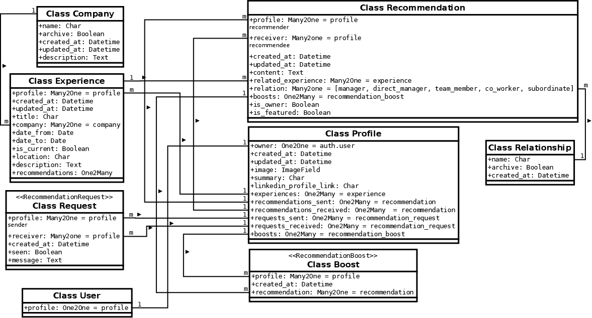

# ENDORSE PLUS API <!-- omit from toc -->

**Developer:** [**Khubab Shamsuddin**](https://www.linkedin.com/in/kshamse/)

[**Live Site URL**](https://endorse-plus.herokuapp.com/)

- [Overview](#overview)
- [Database Design](#database-design)
  - [Profile Model](#profile-model)
  - [Company Model](#company-model)
  - [Relationship Model](#relationship-model)
  - [Experience Model](#experience-model)
  - [Request Model](#request-model)
  - [Recommendation Model](#recommendation-model)
  - [Boost Model](#boost-model)
- [Technologies](#technologies)
  - [Languages and Frameworks](#languages-and-frameworks)
  - [Other Software and Libraries](#other-software-and-libraries)
- [Credits](#credits)

# Overview
The API server side of the Endorse Plus application is built mainly using the Django Rest Framework to provide APIs through its generic API views. Postgresql is used to store the application data. Deployment has been done on the Heroku platform.

# Database Design

The models of the data in this application were designed as the following diagram:

## Profile Model
- The profile model contains fields of `name, owner, title,  created_at, updated_at, image, summary, and linkedin_profile_url`.
- Owner: One-to-one relationship with User model `auth.User`.

## Company Model
- The company model contains fields of `name, archive,  created_at, and description`.

## Relationship Model
- The relationship model contains fields of `name, archive,  and created_at`.
  
## Experience Model
- The experience model contains fields of `profile, title, company, date_from, date_to, is_current, location, created_at, updated_at, and description`.
- The profile is `ForeignKey` from the `Profile` model.
- The company is `ForeignKey` from the `Company` model.

## Request Model
- The request model contains fields of `profile, receiver, created_at, seen, and message`.
- The profile is `ForeignKey` from the `Profile` model.
- The receiver is `ForeignKey` from the `Profile` model.

## Recommendation Model
- The recommendation model contains fields of `profile, receiver, created_at, updated_at, related_experience, relation, is_featured, and content`.
- The profile is `ForeignKey` from the `Profile` model.
- The receiver is `ForeignKey` from the `Profile` model.
- The related_experience is `ForeignKey` from the `Experience` model.
- The relation is `ForeignKey` from the `Relationship` model.

## Boost Model
- The boost model contains fields of `profile, created_at, recommendation, and content`.
- The profile is `ForeignKey` from the `Profile` model.
- The recommendation is `ForeignKey` from the `Recommendation` model.

# Technologies

## Languages and Frameworks
- Python.
- Django Rest Framework.

## Other Software and Libraries
- [Cloudinary](https://cloudinary.com/) was used to store the site's static files and users' images.
- [Dia](http://dia-installer.de/) was used to draw the designed database schema.
- [Psycopg](https://pypi.org/project/psycopg2/) was used alongside [DJ-Database-URL](https://pypi.org/project/dj-database-url/) to create and handle the Postgresql connection.
- [Visual Studio Code](https://code.visualstudio.com/) was used as a code editor to develop this project.
- [Gitpod](https://gitpod.io/) was used as an online development environment to develop and test this project.
- [Github](https://github.com/) was used to store the code of this project.
- [Heroku](https://www.heroku.com/) was used for the deployment of this API server. 
- [QuillBot](https://quillbot.com/) was used to check the grammar of the readme file.
- [Grammarly](https://marketplace.visualstudio.com/items?itemName=znck.grammarly) was used to check the grammar of the readme file on VS Code.

<!-- # Testing -->
# Credits

- This project was developed based on the Code Institute's [DRF-API walkthrough project](https://github.com/Code-Institute-Solutions/drf-api).
- Filter foreign key query set solved by the code from [Ehsan Nouri's](https://stackoverflow.com/questions/52223241/django-rest-framework-filter-using-foreign-key) answer.
- Filtering a specific record out of the model objects was taken from [Dave Vogt's](https://stackoverflow.com/questions/687295/how-do-i-do-a-not-equal-in-django-queryset-filtering) answer.
- Admin or read-only permission class code was inspired by [Ansuman Bebarta's](https://stackoverflow.com/questions/37968770/django-rest-framework-permission-isadminorreadonly) answer.
- Counting unseen requests in the request serializer is taken from [Dalvtor's](https://stackoverflow.com/questions/56527255/get-count-of-each-item-separately-in-a-queryset-django-drf) answer.
- Overriding the update function in the recommendation and request serializers was taken from [Roba's](https://stackoverflow.com/questions/33424212/django-rest-framework-possible-to-allow-unadmin-users-to-only-change-one-field) answer.